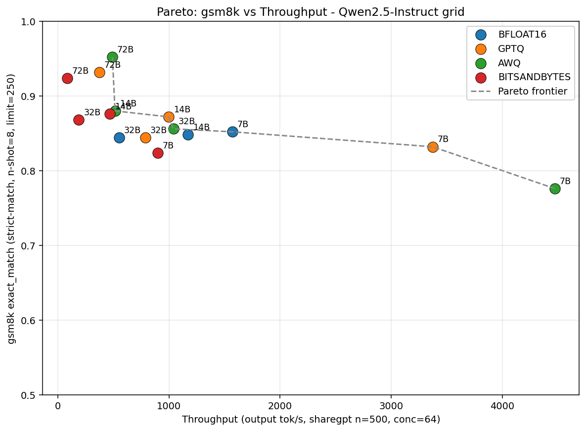
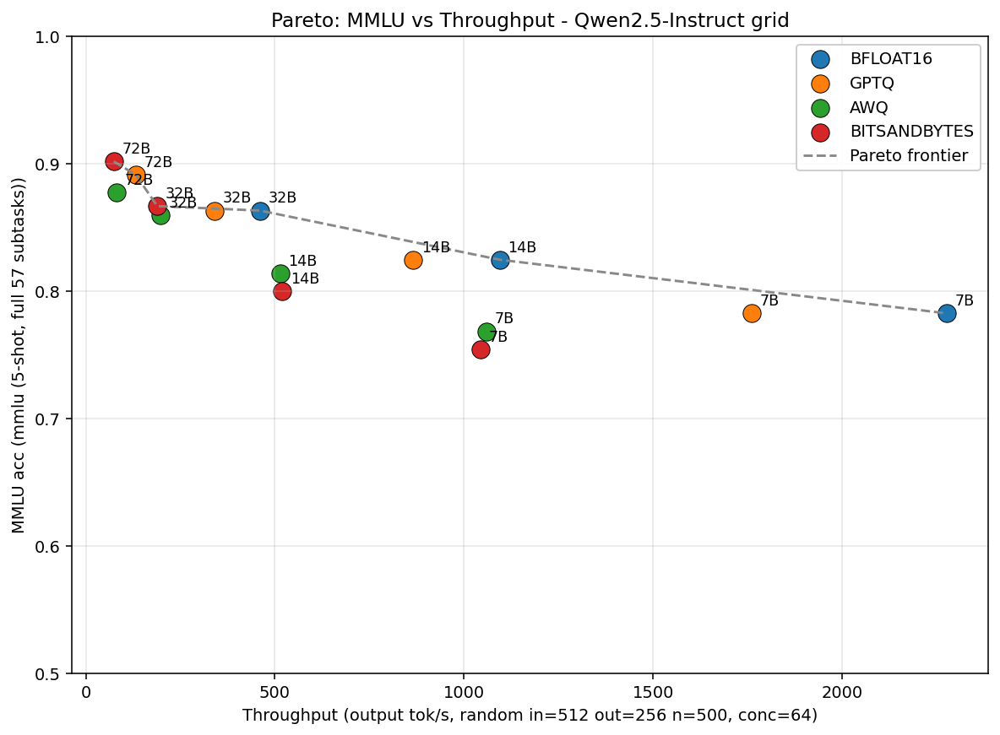

# HPML Final Project: Scaling vs. Precision: Mapping the Pareto Frontier of Memory-Bound LLM Inference
> **Course:** High Performance Machine Learning  
> **Semester:** Spring 2026  
> **Instructor:** Dr. Kaoutar El Maghraoui

---

## Team Information

- **Team Name:** Scaling vs. Precision
- **Members:**
  - Benjamin Benscher (beb2181) — *models, quantization, benchmark execution*
  - Theodore Schiffman (tcs2154) — *infrastructure, remote GPU environment, profiling*
  - Christian Montgomery (cm4521) — *benchmark harness, performance analysis, visualizations*
  - Armand Link (al4570) — *evaluation suite, quality benchmarks, results analysis*

## Submission

- **GitHub repository:** [https://github.com/schiff6827/hpml-quant](https://github.com/schiff6827/hpml-quant)
- **Final report:** [`deliverables/HPML_Final_Report.pdf`](deliverables/HPML_Final_Report.pdf)
- **Final presentation:** [`deliverables/HPML_Final_Presentation.pptx`](deliverables/HPML_Final_Presentation.pptx)
- **Experiment-tracking dashboard:** [`results/dashboard/index.html`](results/dashboard/index.html)

This repository includes a static dashboard export under `results/dashboard/` because the experiment tracking artifacts are local rather than hosted on a public Wandb/MLflow/TensorBoard service.

---

## 1. Problem Statement

Large language model inference is often constrained by GPU memory capacity and memory bandwidth rather than raw compute. Under a fixed 96 GB VRAM budget, practitioners must choose between running a smaller model at higher precision or a larger model with aggressive quantization. This project targets **inference** and maps the quality-throughput Pareto frontier for Qwen2.5-Instruct models across model scale and weight precision.

---

## 2. Model/Application Description

- **Model architecture:** Qwen2.5-Instruct dense decoder-only LLMs at 7B, 14B, 32B, and 72B nominal scales.
- **Precision formats:** unquantized 16-bit baseline reported by vLLM as BF16, official GPTQ-Int8, official AWQ-Int4, and locally materialized BitsAndBytes NF4 with double quantization and BF16 compute.
- **Framework:** vLLM for inference serving and performance benchmarking; lm-eval-harness for quality evaluation; NVIDIA Nsight Systems for selected kernel-level profiling.
- **Datasets/workloads:**
  - ShareGPT prompts from `anon8231489123/ShareGPT_Vicuna_unfiltered` for chatbot-shaped throughput benchmarking.
  - GSM8K via lm-eval-harness for math reasoning quality.
  - Synthetic random prompts with 512 input tokens and 256 output tokens for fixed-shape throughput benchmarking.
  - MMLU via lm-eval-harness for general knowledge quality.
- **Custom layers or modifications:** no model architecture changes. The project changes the inference stack, weight precision, serving configuration, and measurement harness.
- **Hardware target:** 1x NVIDIA RTX PRO 6000 Blackwell Max-Q Workstation Edition with 96 GB VRAM.

---

## 3. Final Results Summary

The project is a Pareto-frontier study rather than a single baseline-to-optimized training run. The table below reports representative measured points from the two complete primary sweeps.

| Metric | Reference | Pareto / Optimized Point | Delta |
| --- | ---: | ---: | ---: |
| GSM8K strict accuracy, 7B Normal/BF16 vs 7B AWQ | 0.852 | 0.776 | -7.6 pp |
| ShareGPT decode throughput, 7B Normal/BF16 vs 7B AWQ | 1,573 tok/s | 4,474 tok/s | 2.84x higher |
| ShareGPT peak VRAM, 7B Normal/BF16 vs 7B AWQ | 28.1 GiB | 19.5 GiB | 31% lower |
| GSM8K strict accuracy, 32B Normal/BF16 vs 72B AWQ | 0.844 | 0.952 | +10.8 pp |
| ShareGPT decode throughput, 32B Normal/BF16 vs 72B AWQ | 551 tok/s | 491 tok/s | 11% lower |
| MMLU accuracy, 7B Normal/BF16 vs 72B BnB-NF4 | 0.782 | 0.902 | +12.0 pp |
| Random 512/256 throughput, 7B Normal/BF16 vs 72B BnB-NF4 | 2,276 tok/s | 74 tok/s | 30.8x lower |
| Peak GPU memory, 72B GPTQ-Int8 vs 72B AWQ-Int4 | 88.1 GiB | 54.9 GiB | 38% lower |

**Hardware:** 1x NVIDIA RTX PRO 6000 Blackwell Max-Q Workstation Edition, 96 GB VRAM, NVIDIA driver 582.16, CUDA 12.8 build, PyTorch 2.10.0+cu128, Ubuntu 24.04.4 under WSL2.

**Headline result:** On ShareGPT/GSM8K, AWQ-Int4 produces the dominant frontier from small fast configurations to the high-quality 72B configuration, while the random/MMLU grid shows that the best frontier depends strongly on workload shape and quality metric.

---

## 4. Repository Structure

```text
.
├── README.md
├── app.py                         # Streamlit app entry point
├── config.py                      # Local model/cache/server configuration
├── model.yaml                     # Model registry and precision metadata
├── benchmarks/                    # Raw benchmark JSONs, plots, and analysis scripts
│   ├── sharegpt_gsm8k_grid/       # ShareGPT throughput + GSM8K quality sweep
│   ├── random_mmlu_grid/          # Random 512/256 throughput + MMLU quality sweep
│   ├── context_sweep_grid/        # Context-capacity results
│   ├── nsys/                      # Nsight Systems summaries and plots
│   └── scripts/                   # Saved benchmark presets
├── metrics/                       # Per-run sampled GPU/vLLM/CPU CSV traces
├── pages/                         # Streamlit UI pages
├── results/
│   └── dashboard/                 # Static dashboard export for submission
├── scripts/                       # Quantization, context sweep, profiling helpers
├── services/                      # vLLM, benchmark, queue, metrics, and HF services
└── testnb.ipynb                   # Exploratory notebook
```

---

## 5. Reproducibility Instructions

### A. Environment Setup

The original experiments were run on a shared workstation with the following observed environment in the lm-eval output artifacts: Python 3.11.14, PyTorch 2.10.0+cu128, Transformers 4.57.1, lm-eval-harness 0.4.11, Ubuntu 24.04.4, and NVIDIA driver 582.16.

```bash
git clone https://github.com/schiff6827/hpml-quant.git
cd hpml-quant

# Recommended: create a clean environment, then install the inference/eval stack.
python3 -m venv .venv
source .venv/bin/activate
pip install vllm lm-eval transformers bitsandbytes huggingface_hub psutil streamlit matplotlib
```

Full-grid reproduction requires a GPU with enough VRAM for the selected model/precision cell. The reported full matrix was run on a 96 GB GPU. Model weights are not committed to this repository.

### B. Experiment Tracking Dashboard

Static dashboard export:

```text
results/dashboard/index.html
```

Open locally:

```bash
open results/dashboard/index.html
```

or serve from the repository root:

```bash
python3 -m http.server 8080
```

Then visit:

```text
http://localhost:8080/results/dashboard/
```

The dashboard includes a run list, raw perf/quality JSON links, metric trace CSVs, Pareto plots, latency charts, memory charts, context-capacity plots, and Nsight summaries.

### C. Dataset and Model Artifacts

The datasets and model weights are not committed. The benchmark harness downloads or accesses them through Hugging Face and lm-eval-harness:

- ShareGPT prompt dataset: `anon8231489123/ShareGPT_Vicuna_unfiltered`
- GSM8K: `openai/gsm8k` via lm-eval-harness
- MMLU: lm-eval-harness task suite
- Qwen2.5 checkpoints: Hugging Face model IDs such as `Qwen/Qwen2.5-7B-Instruct-AWQ`

Large model weights were stored on the experiment workstation under a shared model cache, configured in `config.py`.

### D. Training

This project does not train or fine-tune models. It is an inference benchmarking and profiling study.

### E. Evaluation

The Streamlit application can be launched with:

```bash
streamlit run app.py
```

The benchmark queue and saved presets under `benchmarks/scripts/` were used to run paired performance and quality sweeps. The key benchmark settings are documented in:

```text
benchmarks/sharegpt_gsm8k_grid/RUN_SETTINGS.md
benchmarks/random_mmlu_grid/RUN_SETTINGS.md
benchmarks/context_sweep_grid/RUN_SETTINGS.md
```

### F. Profiling

Runtime system metrics are sampled into `metrics/` by `services/metrics_service.py`. Context-capacity runs use:

```bash
python3 scripts/run_context_sweep.py \
  --model Qwen/Qwen2.5-7B-Instruct-AWQ \
  --result-dir benchmarks/context_sweep_grid \
  --run-name example_context_sweep \
  --gpu-mem-util 0.95
```

Nsight helper scripts are under `scripts/run_ncu.py` and `benchmarks/nsys/analyze.py`. The committed Nsight plots are a selected kernel-level profiling slice, not a full Nsight trace for every grid cell.

### G. Quickstart: Inspect the Headline Results

```bash
# From the repository root:
python3 -m http.server 8080

# Then open:
# http://localhost:8080/results/dashboard/
```

The dashboard opens to the run list. Use the Charts tab for Pareto, latency, memory, context, and Nsight figures.

---

## 6. Results and Observations

- **Quantization moves the frontier on chatbot-shaped workloads:** On ShareGPT/GSM8K, 7B AWQ reaches 4,474 output tok/s, a 2.84x throughput gain over 7B Normal/BF16, at the cost of lower strict GSM8K accuracy.
- **Larger quantized models can beat smaller full-precision models:** 72B AWQ reaches 0.952 GSM8K strict accuracy while staying within the 96 GB budget; 72B Normal/BF16 does not fit.
- **The frontier depends on workload:** On random 512/256 + MMLU, 7B Normal/BF16 remains the throughput leader, while 72B BnB-NF4 is the highest-quality point.
- **Inference is memory-bound:** The Nsight-derived achieved compute estimates are far below theoretical FP16 peak, explaining why reducing weight bytes can improve throughput even after dequantization overhead.
- **KV cache becomes increasingly important:** Weight quantization frees VRAM for longer contexts, but the KV cache remains unquantized in the main sweeps and becomes a future bottleneck at higher concurrency or longer sequences.

Representative figures:





---

## 7. Notes

- Source code for the app and services lives under `pages/`, `services/`, and `scripts/`.
- Raw benchmark JSONs are in `benchmarks/`.
- Per-run metric traces are in `metrics/` and copied into the static dashboard export.
- Model checkpoints are not committed because of size; they were cached on the shared workstation.
- Secrets and Hugging Face tokens, if needed, should be provided through environment variables.

### AI Usage Disclosure

We used AI to assist with many facets of this project.

**Tools used:** Claude Code, Codex, Claude, Gemini, ChatGPT.

**Purposes:**

- Claude Code was used extensively to create the HPML Model Manager GUI, which was the main tool we used to execute all procedural facets of the project.
- Codex was used for code review.
- Claude, Gemini, and ChatGPT were used to find relevant published research on our project topic and to research and assist in selecting the LLM serving platform, quantization packages, and performance benchmarks.

**Questions/Sections affected:** The final presentation and written report are our own work, with the exception of the included charts, which were created using AI-written code.

**How we verified correctness:** We tested functionality and inspected output. We ran an adversarial code review with Codex using this prompt:

```text
/codex:adversarial-review --base main Correctness-only review. Verify whether this code performs its stated intent. Specifically, review all code for the GUI, and verify that execution matches the labels and options in the GUI. Review all plotting code and the code that generates the data used by the plotting code to verify the data being generated and plotted matches the intent. This review should not cover any other topics, including security, race conditions, style, maintainability, performance, dependency issues, and speculative edge cases unless they directly cause incorrect output. Read all files in the project directory (not just code) to infer the intended behavior. Produce a report with: 1. Summary verdict, 2. Intended behavior, 3. Evidence checked, 4. Correctness issues, 5. Output mismatches. Do not modify files.
```

By submitting this assignment, we confirm that the analysis, interpretations, and conclusions are our own, and that any AI assistance is fully disclosed above.

### License

Released under the MIT License. See [`LICENSE`](LICENSE).

<!-- ### Citation

If you build on this work, please cite:

```bibtex
@misc{scalingprecision2026hpml,
  title = {Scaling vs. Precision: Mapping the Pareto Frontier of Memory-Bound LLM Inference},
  author = {Benscher, Benjamin and Schiffman, Theodore and Montgomery, Christian and Link, Armand},
  year = {2026},
  note = {HPML Spring 2026 Final Project, Columbia University},
  url = {https://github.com/schiff6827/hpml-quant}
}
``` -->

### Contact

Open a GitHub Issue on the project repository.

---

*HPML Spring 2026 — Dr. Kaoutar El Maghraoui — Columbia University*
